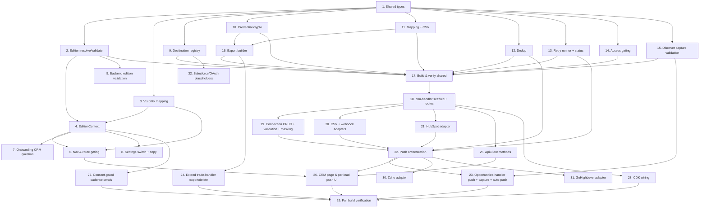

# Implementation Plan: Discover & Grow Editions

## Overview

Tasks are ordered for incremental delivery and follow the design's phasing. Phase 1 is buildable now with zero external approvals (except the user's own HubSpot token). Phase 2 adds Zoho/GoHighLevel API-key adapters. Phase 3 (Salesforce & marketplace OAuth) is deferred — registry placeholders only, no working adapters.

All pure logic lives in `packages/shared/src/crm/` with vitest + fast-check property tests (100 iterations, each tagged `// Feature: discover-and-grow-editions, Property N: ...`). The committed CommonJS Lambdas import/copy the compiled functions so the handlers stay thin I/O shells.

## Tasks

### Phase 1 — Foundations & Edition Split

- [x] 1. Add shared types for editions and CRM
  - Add `Edition`, `PushStatus`, `CrmDestinationInfo`, `CrmConnection` (masked creds), `FieldMapping`, `PushResult` to `packages/shared/src/types/index.ts`
  - Extend `Opportunity` with `pushStatus`, `crmRecordId?`, `lastPushError?`, `pushedAt?`, `pushedConnectionId?`
  - _Requirements: 2.1, 10.1, 11.1, 15.1_

- [x] 2. Implement edition resolution + validation (pure)
  - Create `packages/shared/src/crm/edition.ts`: `resolveEdition(stored)` (defaults to `grow` for missing/empty/unknown), `validateEdition(value)` (accepts only `discover`/`grow`)
  - Property test — Property 1 (resolve defaults to grow), Property 3 (write validation rejects invalid)
  - _Requirements: 1.4, 2.1, 2.6, 2.7_

- [x] 3. Implement edition→visibility mapping (pure)
  - Create `packages/shared/src/crm/visibility.ts`: `navForEdition(edition)` returning the allowed nav/feature set; grow set is a superset of discover; discover excludes pipeline/follow-up/scheduling/revenue
  - Property test — Property 4 (visibility mapping), Property 5 (pipeline data preserved across switch — pure check that switch produces no record mutation)
  - _Requirements: 4.1, 4.2, 5.1, 5.2, 3.3, 3.4_

- [x] 4. EditionContext + persistence round-trip
  - Create `apps/web/src/contexts/EditionContext.tsx` mirroring `ModeContext`: local-first hydrate, server hydrate from `GET /profile/preferences`, `setEdition` persists first and returns `false` on failure (reverts + toast)
  - Wire provider in `apps/web/src/App.tsx`
  - Property test — Property 2 (persistence round-trip via resolve/validate helpers)
  - _Requirements: 1.7, 2.2, 2.3, 2.4, 2.5, 3.7_

- [x] 5. Edition validation on the backend
  - In `lambdas/dist/trade-handler/index.js`, validate `edition` in the `PUT /profile/preferences` merge path; reject non-`discover`/`grow` with `400 VALIDATION_ERROR`, leaving stored value unchanged
  - `node --check lambdas/dist/trade-handler/index.js`
  - _Requirements: 2.1, 2.6_

- [~] 6. Navigation & route gating in the web app
  - Done: `/crm` entry added to the More menu; CRM page reachable. Deferred: hiding pipeline/scheduling/revenue nav in Discover + route redirects (visibility helper `navForEdition` is built & tested, not yet wired into AppShell filtering).
  - Filter `navItems`/`moreItems` in `apps/web/src/components/AppShell.tsx` through `navForEdition`; add a `/crm` entry shown in both editions
  - Add route guards in `App.tsx` and gate `PipelinePage.tsx` so a Discover user hitting a hidden route is redirected to `/` (data never deleted)
  - _Requirements: 4.1, 4.2, 3.3_

- [ ] 7. Onboarding CRM question
  - Not yet added to SetupWizard. Edition defaults to Grow and is fully switchable in Settings (task 8), so users can pick Discover today; the onboarding prompt is a follow-up.
  - Add the "Do you already use a CRM?" step to `apps/web/src/components/SetupWizard.tsx`; yes→`discover`, no→`grow`; dismiss/skip→`grow` and keep step accessible; show Discover vs Grow capability copy
  - UI test — question presence, yes/no→edition mapping, skip default
  - _Requirements: 1.1, 1.2, 1.3, 1.5, 1.6_

- [x] 8. Settings edition switch + copy
  - Add edition switch to `apps/web/src/pages/SettingsPage.tsx`: shows current + other, both editions' capability descriptions; unsaved-input confirm prompt on switch; cancel restores everything
  - Add positioning statement and "everything in Discover plus" list to the upgrade section
  - UI test — switch display, unsaved-input confirm + cancel, positioning copy
  - _Requirements: 3.1, 3.5, 3.6, 14.1, 14.2, 14.3_

### Phase 1 — CRM Push Core (pure logic)

- [x] 9. Destination availability registry (pure)
  - Create `packages/shared/src/crm/destinations.ts`: registry with `availability` (`available` | `requires_approval`), connection method, and reason; helpers to list and to reject `requires_approval` selection
  - Include placeholder entries for `salesforce` and `ghl_marketplace` as `requires_approval` (Phase 3, no adapter)
  - Property test — Property 8 (registry invariants)
  - _Requirements: 6.1, 6.5, 6.6, 6.7, 14.4_

- [x] 10. Credential crypto (pure interface + KMS-backed impl)
  - Create `packages/shared/src/crm/crypto.ts`: `encrypt`/`decrypt` over an injectable backend (AES-GCM for tests, KMS in the Lambda) and `maskCredential`
  - Property test — Property 9 (encrypt/decrypt round-trip, ciphertext ≠ plaintext), Property 10 (masking on read)
  - _Requirements: 7.2, 7.3, 15.2, 15.4_

- [x] 11. Field mapping + payload builder + CSV (pure)
  - Create `packages/shared/src/crm/mapping.ts`: `canActivate(mapping, requiredFields)` (returns unmapped required set), `buildPayload(lead, mapping)` (transmit only mapped fields; absent value → empty), `toCsv`/`parseCsv`
  - Property test — Property 11 (activation gate), Property 12 (transmit only mapped), Property 18 (CSV round-trip)
  - _Requirements: 8.1, 8.3, 8.4, 8.5, 8.6, 12.1_

- [x] 12. Dedup decision (pure)
  - Create `packages/shared/src/crm/dedup.ts`: `pushDecision(lead, destination)` (upsert iff stored id AND supportsUpsert; confirm if id but no upsert; else create), `detectDuplicate(lead, alreadyPushed)` (exact email/phone match)
  - Property test — Property 14 (dedup decision), Property 15 (contact-match detection)
  - _Requirements: 10.2, 10.3, 10.4, 10.5_

- [x] 13. Retry/backoff runner + error classification + status machine (pure)
  - Create `packages/shared/src/crm/push-core.ts`: `runPush(adapter, payload, creds, {sleep})` with `[1s,2s,4s]` backoff, `classifyError` (transient: timeout/429/5xx; non-transient: other 4xx/incompatible), and status transitions
  - Property test — Property 16 (retry/backoff sequence), Property 17 (status transitions)
  - _Requirements: 11.1, 11.2, 11.3, 11.4, 11.5, 11.6, 12.5, 12.6_

- [x] 14. Access gating + orthogonality (pure)
  - Create `packages/shared/src/crm/gating.ts`: `hasAccess(edition, tier, feature)` = editionExposes AND tierEntitles; orthogonal setters that never mutate the other dimension
  - Property test — Property 19 (edition/tier/mode orthogonal), Property 20 (access requires both)
  - _Requirements: 13.1, 13.2, 13.3, 13.4, 13.5, 13.6_

- [x] 15. Discover capture validation (pure)
  - Create `packages/shared/src/crm/capture.ts`: `validateDiscoverCapture(lead)` requiring `sourcePlatform`, `sourceUrl`, `leadSource`, `consentBasis`; returns each missing field
  - Property test — Property 6 (capture required-field validation)
  - _Requirements: 4.7_

- [x] 16. Export builder (pure)
  - Create `packages/shared/src/crm/export.ts`: `buildExport(account)` including edition, masked CRM connections, per-lead push status; no plaintext/ciphertext credential anywhere
  - Property test — Property 21 (export completeness without raw creds)
  - _Requirements: 15.3, 15.4_

- [x] 17. Build & verify shared package
  - `pnpm --filter @social-lead-gen/shared run build` and run the vitest suite (all Properties 1, 3, 4, 5, 6, 8, 9, 10, 11, 12, 14, 15, 16, 17, 18, 19, 20, 21 green)
  - _Requirements: (verification)_

### Phase 1 — CRM Handler Lambda & Adapters

- [x] 18. crm-handler scaffolding + routes
  - Create `lambdas/dist/crm-handler/index.js` (CommonJS, shared `respond`/`getUserId`, method+path switch) and copy compiled pure modules (`destinations.js`, `crypto.js`, `mapping.js`, `push-core.js`)
  - Routes: `GET /crm/destinations`, `GET/POST /crm/connections`, `PUT/DELETE /crm/connections/{id}`, `POST /crm/connections/{id}/activate`, `POST /crm/push`, `POST /crm/export/csv`
  - _Requirements: 6.6, 7.1, 7.3, 8.3, 9.1, 12.1_

- [x] 19. Connection CRUD + validation + masking
  - Implement create (encrypt creds, validate against destination within 30s via AbortController, store `active:false` on failure with reason), update, activate (block on unmapped required), delete (remove ciphertext, mark orphaned leads), and mask creds on every read
  - Integration test (mocked destinations) — success/failure/timeout, not-active-on-failure, masked reads
  - _Requirements: 6.7, 7.2, 7.3, 7.4, 7.5, 7.6, 7.7, 8.3, 8.4_

- [x] 20. CSV + webhook adapters (Phase 1)
  - Create `lambdas/dist/crm-handler/adapters/csv.js` (row builder, `supportsUpsert:false`) and `webhook.js` (HTTP POST mapped fields, 2xx within 30s = success)
  - Implement `POST /crm/export/csv` (reject zero leads; no partial file on generation failure)
  - _Requirements: 12.1, 12.2, 12.3, 12.4, 12.5, 12.6, 12.7_

- [x] 21. HubSpot adapter (Phase 1)
  - Create `lambdas/dist/crm-handler/adapters/hubspot.js` using the user's private-app token: `validate`, `push`, `upsert` (by id/email), `requiredFields:['email']`, `supportsUpsert:true`
  - _Requirements: 6.2, 7.4, 8.2, 10.3_

- [x] 22. Push orchestration (dedup + retry + status)
  - Implement `POST /crm/push`: dedup check (`409 NEEDS_CONFIRMATION` with matching lead / repush reason unless `confirmRepush`), set `pending`, decrypt creds, build payload, run retry runner, persist `pushed`+`crmRecordId`+`pushedAt` or `failed`+`lastPushError`; `409 NO_ACTIVE_CONNECTION` when none
  - Property test — Property 13 (no push without active connection, via the guard function)
  - _Requirements: 9.1, 9.4, 10.1, 10.2, 10.4, 10.5, 10.6, 11.2, 11.3, 11.6_

- [~] 23. Opportunities-handler push fields + capture validation + auto-push
  - Done: push-status fields on GET/create, `pushStatus:'not_pushed'` default, Discover capture validation. Deferred: auto-push-on-capture (needs push-core copied into opportunities-handler + KMS grant) — manual push works today.
  - In `lambdas/dist/opportunities-handler/index.js`: return push fields from `GET /opportunities`; default `pushStatus:'not_pushed'` on create; apply `validateDiscoverCapture` when edition is `discover` (reject partial, list missing); trigger auto-push (best-effort, records outcome, never blocks capture) when `preferences.autoPushOnCapture === true` and an active connection exists via the copied `push-core.js`
  - `node --check` both handlers
  - _Requirements: 4.7, 9.3, 9.6, 11.1_

- [x] 24. Extend trade-handler export/delete
  - Extend `/profile/export` to include edition + masked CRM connections + per-lead push status (no partial on failure); extend `/profile/delete` to remove edition, all `CRM_CONN#*` (ciphertext included) and push-status data, reporting `incomplete` (retryable) if any deletion fails
  - _Requirements: 15.3, 15.4, 15.5, 15.6, 15.7_

- [x] 25. ApiClient methods
  - Add to `packages/shared/src/api-client/index.ts`: `getCrmDestinations`, `getCrmConnections`, `createCrmConnection`, `updateCrmConnection`, `activateCrmConnection`, `deleteCrmConnection`, `pushLeadToCrm`, `exportLeadsCsv`
  - _Requirements: 6.6, 7.1, 8.1, 9.1, 12.1_

### Phase 1 — Frontend CRM UI & Infra

- [x] 26. CRM page & per-lead push UI
  - Create `apps/web/src/pages/CrmPage.tsx`: destination picker (disable `requires_approval` with reason), connection form (retain values on failure), field-mapping editor (block activation listing unmapped required), CSV export button
  - Add per-lead "Push to CRM" action + status badge (`not_pushed`/`pending`/`pushed`/`failed`) + manual Retry in the lead views; "no active connection" prompts to configure
  - UI/integration test — push confirmation, retry restarts sequence, requires_approval not selectable
  - _Requirements: 4.8, 4.9, 4.10, 6.7, 7.6, 8.3, 9.1, 9.4, 11.7, 12.1, 14.4_

- [ ] 27. Consent-gated cadence sends (Grow)
  - Not yet implemented in the cadence sender; consent basis is captured on leads (prior work) but the send-time filter + CAN-SPAM content pass is still to do.
  - Ensure the Grow follow-up cadence sender only sends to leads whose `consentBasis` permits contact (skip + record skipped), and follow-up emails include CAN-SPAM unsubscribe/sender content
  - Property test — Property 7 (consent-gated sends); example test — CAN-SPAM content present
  - _Requirements: 5.8, 5.9, 5.10, 4.4, 4.5_

- [x] 28. CDK wiring
  - In `packages/cdk/lib/api-stack.ts`: add `SocialLeadGen-CrmHandler` function (timeout 35s), `grantReadWriteData`, KMS `Encrypt`/`Decrypt`/`GenerateDataKey` grant, and all `/crm/*` routes with the shared Cognito authorizer
  - Add the `crmCredsKey` KMS CMK in the stack owning the table and pass its ARN through `ApiStackProps` → Lambda env `CRM_KMS_KEY_ID`
  - CDK snapshot test — function, routes, KMS grant present
  - _Requirements: 7.2, and infrastructure wiring for all CRM routes_

- [x] 29. Full build verification
  - `pnpm --filter @social-lead-gen/shared run build`, `pnpm --filter @social-lead-gen/web run build`, `node --check` for `crm-handler`/`opportunities-handler`/`trade-handler`, and `pnpm --filter @social-lead-gen/cdk exec tsc --noEmit`
  - _Requirements: (verification)_

### Phase 2 — Additional API-key adapters

- [x] 30. Zoho CRM adapter
  - Create `lambdas/dist/crm-handler/adapters/zoho.js` (user API key/token; validate/push/upsert); flip registry entry to `available`
  - _Requirements: 6.4_

- [x] 31. GoHighLevel adapter
  - Create `lambdas/dist/crm-handler/adapters/gohighlevel.js` (private token; validate/push/upsert); flip registry entry to `available`
  - _Requirements: 6.4_

### Phase 3 — Deferred (registry placeholders only)

- [x] 32. Salesforce & marketplace-OAuth placeholders
  - Keep `salesforce` and `ghl_marketplace` registry entries as `availability: 'requires_approval'` with label "requires approval — not yet available"; do NOT implement working adapters until an approved OAuth app exists
  - _Requirements: 6.3, 6.5, 6.7, 14.4_

## Task Dependency Graph

```json
{
  "waves": [
    { "wave": 1, "tasks": ["1"] },
    { "wave": 2, "tasks": ["2", "3", "9", "10", "11", "12", "13", "14", "15"] },
    { "wave": 3, "tasks": ["4", "5", "16"] },
    { "wave": 4, "tasks": ["6", "7", "8", "17"] },
    { "wave": 5, "tasks": ["18"] },
    { "wave": 6, "tasks": ["19", "20", "21", "24", "25"] },
    { "wave": 7, "tasks": ["22", "27"] },
    { "wave": 8, "tasks": ["23", "26", "28"] },
    { "wave": 9, "tasks": ["29"] },
    { "wave": 10, "tasks": ["30", "31", "32"] }
  ]
}
```



## Notes

- **Phasing:** Tasks 1–29 are Phase 1 (buildable now, no external approvals beyond the user's own HubSpot token). Tasks 30–31 are Phase 2 (user-supplied API keys). Task 32 is Phase 3 — registry placeholders only; do not implement working Salesforce/marketplace-OAuth adapters until an approved OAuth app exists.
- **Pure-logic first:** All correctness-critical logic lives in `packages/shared/src/crm/` as pure functions covered by fast-check property tests (100 iterations, tagged `// Feature: discover-and-grow-editions, Property N: ...`). The committed CommonJS Lambdas import the compiled output so handlers stay thin.
- **Property coverage:** Properties 1–21 from the design are each implemented by exactly one property-based test across tasks 2, 3, 9, 10, 11, 12, 13, 14, 15, 16, 22, 27.
- **Non-PBT criteria** (onboarding copy, settings UI, cross-surface persistence, connection validation timing, push happy path/auto-push, deletion/export failure paths, compliance guards, CDK snapshot) are covered by example/integration/UI tests as noted in the design's Testing Strategy.
- **Compliance:** Drafted responses stay copy-to-clipboard only (never auto-posted); CRM push is outbound data transfer to a user-controlled system, not a social post. Cadence sends remain consent-gated and CAN-SPAM/TCPA compliant.
- **Git:** Force-add `lambdas/dist/*` files (gitignored) with `git add -f` so CDK can deploy them.
- Tasks are strictly implementation activities. Deployment happens via the existing GitHub Actions on push to main.

