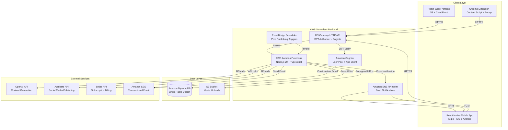
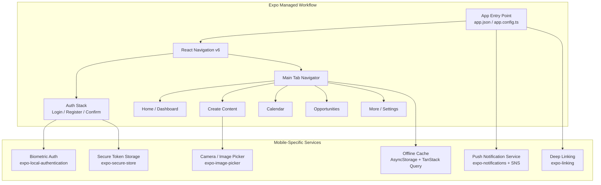
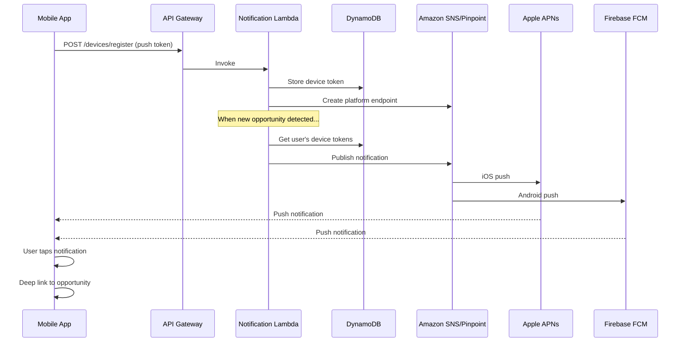
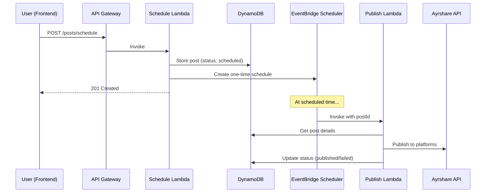

# Design Document: Social Media Lead Generation Platform (Serverless AWS)

## Overview

This design describes a fully serverless multi-platform application for social media tracking and AI-assisted lead generation, targeting local trade professionals (roofers, contractors, insurance agents, realtors, etc.). The system enables users to authenticate, select their trade, track social media keywords via a browser extension, generate AI-powered content, schedule posts, and identify lead opportunities — accessible from both web and mobile (iOS/Android).

The application replaces the previous prototype (in `Old/`) which used Supabase for auth/database and Ayrshare for social media posting. The new architecture is **fully serverless on AWS** with a **shared backend** serving both web and mobile clients:

- **Amazon Cognito** for authentication (user pools, hosted UI, JWT tokens)
- **AWS Lambda + API Gateway (HTTP API)** for backend business logic
- **Amazon DynamoDB** for persistent storage (serverless, pay-per-request)
- **Amazon S3 + CloudFront** for static web frontend hosting and CDN
- **React Native (Expo)** for iOS and Android mobile application
- **Amazon S3** for media uploads (images/videos)
- **Amazon SES** for transactional emails (confirmation, notifications)
- **Amazon SNS / Pinpoint** for mobile push notifications (APNs + FCM)
- **Amazon EventBridge Scheduler** for scheduled post publishing
- **OpenAI API** for AI content generation (called from Lambda)
- **Ayrshare API** for social media publishing (called from Lambda)
- **Stripe API** for subscription billing (webhooks via API Gateway)
- **AWS CDK** for infrastructure as code

### Key Design Decisions

1. **Fully serverless**: Zero server management, automatic scaling, pay-per-use pricing. Ideal for a SaaS product with variable traffic patterns.
2. **Amazon Cognito**: Managed authentication with built-in email verification, password policies, and JWT token issuance. Eliminates custom auth code. Shared between web and mobile clients.
3. **DynamoDB**: Single-table design for low-latency access patterns. Serverless billing mode (pay-per-request) keeps costs near zero during low traffic.
4. **EventBridge Scheduler**: One-time schedules for each post, triggering a Lambda to publish at the exact scheduled time. More precise than cron-based approaches.
5. **S3 + CloudFront**: Static site hosting with global CDN, HTTPS, and cache invalidation on deploy (web frontend).
6. **API Gateway HTTP API**: Lower latency and cost compared to REST API, with native JWT authorizer for Cognito tokens. Serves both web and mobile clients identically.
7. **Retained Ayrshare**: Social media publishing via Ayrshare is proven and retained, called from Lambda.
8. **Browser extension communication**: The extension communicates with API Gateway (not directly with AWS services) for keyword sync and opportunity submission.
9. **React Native with Expo**: Maximizes code sharing with the React web frontend (shared TypeScript types, business logic utilities, API client). Single codebase for iOS and Android. Expo simplifies build/deploy pipeline and provides managed push notification infrastructure.
10. **Amazon SNS/Pinpoint for push notifications**: Native push delivery to APNs (iOS) and FCM (Android) for real-time opportunity alerts. Triggered by Lambda when new keyword matches are detected.
11. **Shared API backend**: Both web and mobile clients consume the exact same API Gateway endpoints with the same Cognito JWT auth. No separate mobile API needed.

## Architecture

### System Architecture Diagram



### Frontend Architecture

```mermaid
graph TB
    subgraph "React Web Application (S3 + CloudFront)"
        Router[React Router v7]
        Router --> AuthPages[Auth Pages<br/>Cognito Hosted UI / Custom]
        Router --> AppShell[App Shell<br/>TopBar + BottomNav]
        AppShell --> Dashboard[Dashboard]
        AppShell --> Create[Content Creator]
        AppShell --> Calendar[Calendar View]
        AppShell --> Opportunities[Opportunities List]
        AppShell --> Keywords[Keyword Manager]
        AppShell --> Settings[Settings / Account]
    end

    subgraph "React Native Mobile App (Expo)"
        NavStack[React Navigation<br/>Stack + Bottom Tabs]
        NavStack --> MAuthScreens[Auth Screens<br/>Cognito via Amplify]
        NavStack --> MTabNav[Tab Navigator]
        MTabNav --> MDashboard[Dashboard]
        MTabNav --> MCreate[Content Creator]
        MTabNav --> MCalendar[Calendar View]
        MTabNav --> MOpportunities[Opportunities List]
        MTabNav --> MMore[More / Settings]
    end

    subgraph "Shared Code (TypeScript Package)"
        Types[Shared Types & Interfaces]
        APIClient[API Client Layer]
        Validators[Zod Validation Schemas]
        Utils[Business Logic Utilities]
    end

    subgraph "State Management"
        AuthCtx[AuthContext<br/>Cognito Tokens via Amplify]
        TradeCtx[TradeContext<br/>Selected Trade]
        QueryClient[TanStack Query<br/>Server State]
    end

    AppShell --> AuthCtx
    AppShell --> TradeCtx
    Dashboard --> QueryClient
    Create --> QueryClient
    Calendar --> QueryClient
    Opportunities --> QueryClient

    MTabNav --> AuthCtx
    MTabNav --> TradeCtx
    MDashboard --> QueryClient
    MCreate --> QueryClient
    MCalendar --> QueryClient
    MOpportunities --> QueryClient

    AppShell --> APIClient
    MTabNav --> APIClient
    APIClient --> Types
    APIClient --> Validators
```



### Mobile App Architecture



### Request Flow

1. User interacts with React web frontend (served from S3 via CloudFront) or React Native mobile app
2. Client authenticates via Cognito (using AWS Amplify Auth library — same flow for web and mobile)
3. Client sends requests to API Gateway with Cognito JWT in Authorization header
4. API Gateway validates JWT via built-in Cognito authorizer
5. API Gateway invokes the appropriate Lambda function
6. Lambda processes business logic, reads/writes DynamoDB, calls external APIs
7. Response flows back through API Gateway to the client, cached by TanStack Query
8. For mobile: push notifications are sent via SNS/Pinpoint when new opportunities are detected

### Push Notification Flow



### Scheduled Post Publishing Flow



## Components and Interfaces

### Lambda Functions

| Function | Trigger | Description |
|----------|---------|-------------|
| `auth-post-confirmation` | Cognito Post Confirmation | Initialize user record in DynamoDB after signup |
| `trade-handler` | API Gateway | Get trades list, update user trade selection |
| `content-handler` | API Gateway | Generate AI content, get history, upload media |
| `posts-handler` | API Gateway | CRUD for scheduled posts |
| `post-publisher` | EventBridge Scheduler | Publish post to Ayrshare at scheduled time |
| `keywords-handler` | API Gateway | CRUD for keywords, get defaults |
| `opportunities-handler` | API Gateway | CRUD for opportunities, stats |
| `subscription-handler` | API Gateway | Get plan info, create checkout |
| `stripe-webhook` | API Gateway (no auth) | Handle Stripe webhook events |
| `daily-cues-handler` | API Gateway | Get/complete daily cues |
| `devices-handler` | API Gateway | Register/unregister push notification device tokens |
| `notification-sender` | DynamoDB Stream / Lambda invoke | Send push notifications via SNS when new opportunities are created |

### API Gateway Routes

#### Authentication (Cognito-managed)

Authentication is handled directly by Amazon Cognito. The frontend uses AWS Amplify Auth to:
- Register users (Cognito `signUp`)
- Confirm email (Cognito `confirmSignUp`)
- Login (Cognito `initiateAuth`)
- Refresh tokens (Cognito `refreshToken`)
- Logout (Cognito `globalSignOut`)

The `auth-post-confirmation` Lambda is triggered by Cognito after email verification to create the user's DynamoDB record.

#### Trade (`/trade`)

| Method | Route | Auth | Description |
|--------|-------|------|-------------|
| GET | `/trade/list` | Yes | Get all available trades |
| PUT | `/trade/select` | Yes | Set user's selected trade |

#### Content (`/content`)

| Method | Route | Auth | Description |
|--------|-------|------|-------------|
| POST | `/content/generate` | Yes | Generate AI content via OpenAI |
| GET | `/content/history` | Yes | Get user's generated content |
| POST | `/content/upload-url` | Yes | Get S3 presigned upload URL |
| DELETE | `/content/{id}` | Yes | Delete generated content |

#### Posts & Scheduling (`/posts`)

| Method | Route | Auth | Description |
|--------|-------|------|-------------|
| POST | `/posts/schedule` | Yes | Schedule a post (creates EventBridge schedule) |
| GET | `/posts` | Yes | Get all posts (with filters) |
| PUT | `/posts/{id}` | Yes | Update a scheduled post |
| DELETE | `/posts/{id}` | Yes | Delete a post (removes EventBridge schedule) |
| POST | `/posts/{id}/publish` | Yes | Publish immediately via Ayrshare |

#### Keywords (`/keywords`)

| Method | Route | Auth | Description |
|--------|-------|------|-------------|
| GET | `/keywords` | Yes | Get user's tracked keywords |
| POST | `/keywords` | Yes | Add a keyword |
| PUT | `/keywords/{id}` | Yes | Update a keyword |
| DELETE | `/keywords/{id}` | Yes | Remove a keyword |
| GET | `/keywords/defaults` | Yes | Get trade-specific defaults |

#### Opportunities (`/opportunities`)

| Method | Route | Auth | Description |
|--------|-------|------|-------------|
| GET | `/opportunities` | Yes | List opportunities (paginated) |
| POST | `/opportunities` | Yes | Create opportunity (from extension) |
| PUT | `/opportunities/{id}/status` | Yes | Update opportunity status |
| DELETE | `/opportunities/{id}` | Yes | Delete an opportunity |
| GET | `/opportunities/stats` | Yes | Get summary statistics |

#### Subscription (`/subscription`)

| Method | Route | Auth | Description |
|--------|-------|------|-------------|
| GET | `/subscription` | Yes | Get current plan and usage |
| POST | `/subscription/checkout` | Yes | Create Stripe checkout session |
| POST | `/subscription/webhook` | No | Handle Stripe webhooks (verified by signature) |
| POST | `/subscription/cancel` | Yes | Cancel subscription |

#### Daily Cues (`/cues`)

| Method | Route | Auth | Description |
|--------|-------|------|-------------|
| GET | `/cues` | Yes | Get today's daily cues |
| PUT | `/cues/{id}/complete` | Yes | Mark a cue as completed |

#### Devices & Push Notifications (`/devices`)

| Method | Route | Auth | Description |
|--------|-------|------|-------------|
| POST | `/devices/register` | Yes | Register a device push token (APNs or FCM) |
| DELETE | `/devices/{deviceId}` | Yes | Unregister a device (on logout or app uninstall) |
| GET | `/devices` | Yes | List user's registered devices |
| PUT | `/devices/{deviceId}/preferences` | Yes | Update notification preferences (mute, categories) |

### Frontend Components

#### Core Layout
- `AppShell` — Main layout with TopBar, content area, BottomNav
- `TopBar` — App header with notifications and settings
- `BottomNav` — Mobile-first bottom navigation (Home, Create, Calendar, Opportunities, More)

#### Authentication
- `LoginPage` — Cognito-powered login (via Amplify UI or custom form)
- `RegisterPage` — Registration with Cognito password policy enforcement
- `ConfirmPage` — Email confirmation code entry
- `AuthGuard` — Route protection using Cognito session state

#### Dashboard
- `DashboardPage` — Main homepage with trade-specific content
- `DailyCuesList` — List of daily action items
- `LeadSummaryCard` — Active lead count and quick stats
- `AIPostSuggestion` — AI-generated post preview
- `UpcomingPostsList` — Today's scheduled posts

#### Content Creation
- `ContentCreatorPage` — AI content generation interface
- `ToneSelector` — Professional/Casual/Educational/Urgent toggle
- `PostTypeSelector` — Trade-specific post type picker
- `PlatformSelector` — Multi-select for target platforms
- `ContentPreview` — Generated content preview with edit
- `MediaUploader` — S3 presigned URL upload component

#### Calendar
- `CalendarPage` — Post scheduling calendar
- `CalendarGrid` — Monthly/weekly/daily view
- `PostCard` — Individual post in calendar (color-coded by status)
- `ScheduleModal` — Date/time picker for scheduling

#### Opportunities
- `OpportunitiesPage` — Lead management list
- `OpportunityCard` — Individual opportunity with source info
- `OpportunityStats` — Summary statistics bar
- `StatusFilter` — Filter by new/followed-up/converted

#### Keywords
- `KeywordsPage` — Keyword management
- `KeywordList` — Current tracked keywords
- `KeywordForm` — Add/edit keyword
- `DefaultSuggestions` — Trade-specific keyword suggestions

#### Settings
- `SettingsPage` — Account and subscription management
- `TradeSelector` — Trade dropdown (reusable)
- `PlanCard` — Current plan display with usage
- `UpgradePrompt` — Upgrade CTA when limits reached

### Browser Extension Components

- `popup.js` — Extension popup UI (status, keyword count, scan button)
- `content.js` — Content script for keyword detection on social pages
- `background.js` — Service worker for API communication and badge updates
- Communication with backend via API Gateway: `POST /opportunities` and `GET /keywords`
- Auth: Extension stores Cognito tokens (obtained via popup login flow)

### Mobile App Components (React Native / Expo)

#### Navigation (React Navigation v6)
- `RootNavigator` — Conditional rendering: AuthStack (unauthenticated) vs MainTabs (authenticated)
- `AuthStack` — Stack navigator: LoginScreen → RegisterScreen → ConfirmScreen
- `MainTabs` — Bottom tab navigator: Home, Create, Calendar, Opportunities, More
- `MoreStack` — Stack navigator within More tab: Settings, Keywords, Account, Subscription

#### Screens
- `LoginScreen` — Cognito login via Amplify, biometric unlock option
- `RegisterScreen` — Registration with Cognito password policy
- `ConfirmScreen` — Email verification code entry
- `DashboardScreen` — Trade-specific daily cues, lead summary, AI suggestion
- `ContentCreatorScreen` — AI content generation with camera/gallery access
- `CalendarScreen` — Scheduled posts calendar (monthly/weekly/daily)
- `OpportunitiesScreen` — Lead list with pull-to-refresh and infinite scroll
- `OpportunityDetailScreen` — Full opportunity details with action buttons
- `KeywordsScreen` — Keyword management with swipe-to-delete
- `SettingsScreen` — Trade selection, notification preferences, account management
- `SubscriptionScreen` — Plan display, in-app purchase or Stripe checkout (via WebView)

#### Mobile-Specific Components
- `PushNotificationHandler` — Registers device token, handles foreground/background notifications
- `DeepLinkHandler` — Parses deep link URLs and navigates to correct screen
- `BiometricGate` — Face ID / fingerprint prompt on app launch (optional)
- `OfflineIndicator` — Banner shown when device is offline
- `MediaPicker` — Camera + gallery picker using `expo-image-picker`
- `PullToRefresh` — Wrapper for pull-to-refresh on list screens
- `SkeletonLoader` — Loading placeholders for offline-first UX

#### Offline Support
- **TanStack Query** with `persistQueryClient` and `AsyncStorage` adapter for caching
- **Optimistic updates** for status changes (opportunity follow-up, cue completion)
- **Queue** for offline mutations: stored in AsyncStorage, replayed on reconnect
- **Network listener** (`@react-native-community/netinfo`) triggers sync on reconnect

### Shared TypeScript Package (`packages/shared`)

Code shared between web frontend, mobile app, and Lambda functions:

```
packages/shared/
├── src/
│   ├── types/          # All TypeScript interfaces (User, Trade, Post, etc.)
│   ├── validators/     # Zod schemas for API request/response validation
│   ├── constants/      # Trade lists, platform enums, tier limits
│   ├── api-client/     # Typed API client (fetch-based, works in web + RN)
│   └── utils/          # Date formatting, keyword matching, status helpers
├── package.json
└── tsconfig.json
```

This package is consumed by:
- `apps/web` — React web frontend
- `apps/mobile` — React Native (Expo) mobile app
- `packages/lambdas` — Backend Lambda functions (types + validators only)

### Shared Interfaces (TypeScript)

```typescript
// Core domain types shared between frontend and Lambda responses

interface User {
  id: string; // Cognito sub
  email: string;
  tradeId: string | null;
  subscriptionTier: 'free' | 'growth' | 'pro';
  createdAt: string;
}

interface Trade {
  id: string;
  name: string;
  defaultKeywords: string[];
  postTypes: string[];
}

interface GeneratedContent {
  id: string;
  userId: string;
  tradeId: string;
  content: string;
  tone: 'professional' | 'casual' | 'educational' | 'urgent';
  postType: string;
  platforms: SocialPlatform[];
  mediaUrls: string[];
  createdAt: string;
}

type SocialPlatform = 'facebook' | 'instagram' | 'linkedin' | 'tiktok';
type PostStatus = 'draft' | 'scheduled' | 'published' | 'failed';

interface ScheduledPost {
  id: string;
  userId: string;
  contentId: string;
  content: string;
  platforms: SocialPlatform[];
  scheduledAt: string;
  publishedAt: string | null;
  status: PostStatus;
  mediaUrls: string[];
  eventBridgeScheduleName: string | null;
}

interface Keyword {
  id: string;
  userId: string;
  keyword: string;
  tradeId: string;
  isDefault: boolean;
  createdAt: string;
}

type OpportunityStatus = 'new' | 'followed_up' | 'converted' | 'dismissed';

interface Opportunity {
  id: string;
  userId: string;
  tradeId: string;
  keywordId: string;
  keywordText: string;
  sourceContent: string;
  sourcePlatform: SocialPlatform;
  sourceUrl: string;
  sourceAuthor: string;
  status: OpportunityStatus;
  detectedAt: string;
}

interface OpportunityStats {
  total: number;
  new: number;
  followedUp: number;
  converted: number;
}

interface DailyCue {
  id: string;
  userId: string;
  tradeId: string;
  title: string;
  description: string;
  completed: boolean;
  date: string;
}

interface Subscription {
  tier: 'free' | 'growth' | 'pro';
  aiGenerationsUsed: number;
  aiGenerationsLimit: number;
  currentPeriodEnd: string;
  stripeCustomerId: string | null;
}

type DevicePlatform = 'ios' | 'android';

interface DeviceRegistration {
  id: string;
  userId: string;
  platform: DevicePlatform;
  pushToken: string; // APNs token (iOS) or FCM token (Android)
  snsEndpointArn: string; // SNS platform endpoint ARN
  notificationPreferences: NotificationPreferences;
  registeredAt: string;
  lastActiveAt: string;
}

interface NotificationPreferences {
  opportunitiesEnabled: boolean;
  scheduledPostReminders: boolean;
  dailyCueReminders: boolean;
  marketingEnabled: boolean;
}

interface PushNotificationPayload {
  type: 'new_opportunity' | 'post_published' | 'post_failed' | 'daily_cue';
  title: string;
  body: string;
  data: {
    deepLink: string; // e.g., "socialleadgen://opportunities/opp-uuid"
    entityId: string;
  };
}
```

## Data Models

### DynamoDB Single-Table Design

The application uses a single DynamoDB table with a composite primary key (`PK`, `SK`) and Global Secondary Indexes (GSIs) for access pattern flexibility.

**Table Name**: `SocialLeadGen`

**Billing Mode**: Pay-per-request (on-demand)

```mermaid
erDiagram
    DynamoDB_Table {
        string PK "Partition Key"
        string SK "Sort Key"
        string GSI1PK "GSI1 Partition Key"
        string GSI1SK "GSI1 Sort Key"
        string GSI2PK "GSI2 Partition Key"
        string GSI2SK "GSI2 Sort Key"
        map data "Entity attributes"
    }
```

### Entity Access Patterns

| Entity | PK | SK | GSI1PK | GSI1SK | Description |
|--------|----|----|--------|--------|-------------|
| User | `USER#{userId}` | `PROFILE` | `EMAIL#{email}` | `USER` | User profile |
| Trade | `TRADE#{tradeId}` | `META` | — | — | Trade definition |
| Content | `USER#{userId}` | `CONTENT#{contentId}` | `USER#{userId}` | `CONTENT#{createdAt}` | Generated content |
| Post | `USER#{userId}` | `POST#{postId}` | `USER#{userId}` | `POST#{scheduledAt}` | Scheduled post |
| Keyword | `USER#{userId}` | `KEYWORD#{keywordId}` | `USER#{userId}#TRADE#{tradeId}` | `KEYWORD#{keyword}` | Tracked keyword |
| Opportunity | `USER#{userId}` | `OPP#{oppId}` | `USER#{userId}` | `OPP#{detectedAt}` | Detected opportunity |
| DailyCue | `USER#{userId}` | `CUE#{date}#{cueId}` | — | — | Daily cue |
| Subscription | `USER#{userId}` | `SUBSCRIPTION` | — | — | Subscription info |
| DefaultKeyword | `TRADE#{tradeId}` | `DEFKW#{keyword}` | — | — | Trade default keywords |
| Device | `USER#{userId}` | `DEVICE#{deviceId}` | — | — | Registered push notification device |

### Global Secondary Indexes

| GSI | PK | SK | Purpose |
|-----|----|----|---------|
| GSI1 | `GSI1PK` | `GSI1SK` | Email lookup, content/post/opportunity by date |
| GSI2 | `GSI2PK` | `GSI2SK` | Additional access patterns (status queries) |

### Key Access Patterns

| Access Pattern | Operation | Key Condition |
|----------------|-----------|---------------|
| Get user by ID | GetItem | PK=`USER#{id}`, SK=`PROFILE` |
| Get user by email | Query GSI1 | GSI1PK=`EMAIL#{email}`, GSI1SK=`USER` |
| List user's content | Query | PK=`USER#{id}`, SK begins_with `CONTENT#` |
| List user's posts | Query | PK=`USER#{id}`, SK begins_with `POST#` |
| Posts by date range | Query GSI1 | GSI1PK=`USER#{id}`, GSI1SK between `POST#{start}` and `POST#{end}` |
| List user's keywords | Query | PK=`USER#{id}`, SK begins_with `KEYWORD#` |
| List user's opportunities | Query GSI1 | GSI1PK=`USER#{id}`, GSI1SK begins_with `OPP#` (sorted by date) |
| Get trade defaults | Query | PK=`TRADE#{tradeId}`, SK begins_with `DEFKW#` |
| Get subscription | GetItem | PK=`USER#{id}`, SK=`SUBSCRIPTION` |
| Get daily cues | Query | PK=`USER#{id}`, SK begins_with `CUE#{date}` |
| List user's devices | Query | PK=`USER#{id}`, SK begins_with `DEVICE#` |

### Entity Schemas

**User Profile**:
```json
{
  "PK": "USER#abc123",
  "SK": "PROFILE",
  "GSI1PK": "EMAIL#user@example.com",
  "GSI1SK": "USER",
  "email": "user@example.com",
  "tradeId": "roofing",
  "subscriptionTier": "free",
  "createdAt": "2024-01-15T10:00:00Z"
}
```

**Scheduled Post**:
```json
{
  "PK": "USER#abc123",
  "SK": "POST#post-uuid",
  "GSI1PK": "USER#abc123",
  "GSI1SK": "POST#2024-02-01T14:00:00Z",
  "contentId": "content-uuid",
  "content": "Check out our latest roof repair...",
  "platforms": ["facebook", "instagram"],
  "mediaUrls": ["https://s3.../image.jpg"],
  "status": "scheduled",
  "scheduledAt": "2024-02-01T14:00:00Z",
  "publishedAt": null,
  "eventBridgeScheduleName": "post-post-uuid",
  "ayrsharePostId": null,
  "createdAt": "2024-01-28T09:00:00Z"
}
```

**Opportunity**:
```json
{
  "PK": "USER#abc123",
  "SK": "OPP#opp-uuid",
  "GSI1PK": "USER#abc123",
  "GSI1SK": "OPP#2024-01-30T15:30:00Z",
  "tradeId": "roofing",
  "keywordId": "kw-uuid",
  "keywordText": "roof leak",
  "sourceContent": "Anyone know a good roofer? We have a leak...",
  "sourcePlatform": "facebook",
  "sourceUrl": "https://facebook.com/...",
  "sourceAuthor": "John D.",
  "status": "new",
  "detectedAt": "2024-01-30T15:30:00Z"
}
```

### Subscription Tiers and Limits

| Tier | AI Generations/Month | Keywords | Scheduled Posts |
|------|---------------------|----------|-----------------|
| Free | 10 | 5 | 10 |
| Growth | 100 | 50 | Unlimited |
| Pro | Unlimited | Unlimited | Unlimited |

### Infrastructure (AWS CDK)

```typescript
// Key CDK constructs (simplified)
const table = new dynamodb.Table(this, 'SocialLeadGenTable', {
  partitionKey: { name: 'PK', type: dynamodb.AttributeType.STRING },
  sortKey: { name: 'SK', type: dynamodb.AttributeType.STRING },
  billingMode: dynamodb.BillingMode.PAY_PER_REQUEST,
  pointInTimeRecovery: true,
});

table.addGlobalSecondaryIndex({
  indexName: 'GSI1',
  partitionKey: { name: 'GSI1PK', type: dynamodb.AttributeType.STRING },
  sortKey: { name: 'GSI1SK', type: dynamodb.AttributeType.STRING },
});

const userPool = new cognito.UserPool(this, 'UserPool', {
  selfSignUpEnabled: true,
  signInAliases: { email: true },
  passwordPolicy: {
    minLength: 8,
    requireUppercase: true,
    requireDigits: true,
  },
  email: cognito.UserPoolEmail.withSES({ fromEmail: 'noreply@app.com' }),
});

const httpApi = new apigatewayv2.HttpApi(this, 'HttpApi', {
  corsPreflight: { allowOrigins: ['https://app.example.com'] },
});

const authorizer = new apigatewayv2Authorizers.HttpUserPoolAuthorizer(
  'CognitoAuthorizer', userPool
);

// Push Notification Platform Applications (SNS)
const iosPlatformApp = new sns.CfnPlatformApplication(this, 'IosPushPlatform', {
  name: 'SocialLeadGen-iOS',
  platform: 'APNS', // Use APNS_SANDBOX for development
  attributes: {
    PlatformCredential: '<APNs-signing-key>',
    PlatformPrincipal: '<APNs-signing-key-id>',
  },
});

const androidPlatformApp = new sns.CfnPlatformApplication(this, 'AndroidPushPlatform', {
  name: 'SocialLeadGen-Android',
  platform: 'GCM',
  attributes: {
    PlatformCredential: '<FCM-server-key>',
  },
});
```


## Correctness Properties

*A property is a characteristic or behavior that should hold true across all valid executions of a system — essentially, a formal statement about what the system should do. Properties serve as the bridge between human-readable specifications and machine-verifiable correctness guarantees.*

### Property 1: Authentication round-trip

*For any* valid email and password (meeting Cognito policy: ≥8 chars, ≥1 uppercase, ≥1 number), registering a new account via Cognito, confirming the email, and then logging in with the same credentials should return valid JWT tokens (id, access, refresh) and the post-confirmation Lambda should have created a DynamoDB user record with the correct email, null trade, and 'free' subscription tier.

**Validates: Requirements 1.1, 1.2**

### Property 2: Invalid credentials are rejected with generic error

*For any* registered user, attempting to login with an incorrect password should return an authentication error that does not reveal whether the email or password was incorrect (same error message for wrong email vs wrong password).

**Validates: Requirements 1.3**

### Property 3: Password validation enforcement

*For any* string, the Cognito password policy (and client-side validator) should accept it if and only if it has length ≥ 8, contains at least one uppercase letter, and contains at least one digit. All other strings should be rejected.

**Validates: Requirements 1.6**

### Property 4: Trade selection persistence round-trip

*For any* valid trade ID from the trades list, calling the trade selection endpoint should update the user's DynamoDB record, and subsequently querying the user profile should return that trade ID.

**Validates: Requirements 2.2, 2.4, 2.5**

### Property 5: Content generation request validation

*For any* content generation request, the Lambda should accept it if and only if: the tone is one of ['professional', 'casual', 'educational', 'urgent'], the post type belongs to the user's selected trade's allowed post types, and the platforms list is a non-empty subset of ['facebook', 'instagram', 'linkedin', 'tiktok'].

**Validates: Requirements 4.2, 4.3, 4.5**

### Property 6: Generated content persistence round-trip

*For any* successfully generated content, querying the user's content history from DynamoDB should include that content with matching tone, post type, platforms, and trade association.

**Validates: Requirements 4.6, 10.2**

### Property 7: Keyword CRUD round-trip

*For any* valid keyword string, adding it to a user's keyword list should make it appear in subsequent queries of that user's keywords. Removing it should make it no longer appear. The keyword should always be associated with the correct user and trade.

**Validates: Requirements 5.3, 10.3**

### Property 8: Default keywords are trade-specific

*For any* trade, the default keywords endpoint should return a non-empty list where every keyword is associated with that specific trade.

**Validates: Requirements 5.6**

### Property 9: Opportunity creation preserves associations

*For any* valid opportunity submission (with keyword_id, source content, platform, and URL), the created opportunity should be retrievable from DynamoDB with the correct keyword_text, trade_id, source_platform, and source_content matching the submission.

**Validates: Requirements 5.2, 5.5**

### Property 10: Opportunity statistics correctly count by status

*For any* set of opportunities belonging to a user with various statuses (new, followed_up, converted, dismissed), the stats endpoint should return counts where: total equals the sum of all opportunities, and each status count equals the actual number of opportunities with that status.

**Validates: Requirements 3.2, 8.4**

### Property 11: Opportunities are sorted by recency

*For any* set of opportunities returned by the list endpoint, they should be ordered by `detectedAt` in descending order (most recent first), leveraging the GSI1SK sort key.

**Validates: Requirements 8.1**

### Property 12: Opportunity status update persists

*For any* opportunity and any valid target status, updating the status should result in the opportunity having the new status when subsequently queried from DynamoDB.

**Validates: Requirements 8.3**

### Property 13: Opportunity deletion removes record

*For any* opportunity belonging to a user, after deletion, that opportunity should not appear in the user's opportunity list or stats.

**Validates: Requirements 8.5**

### Property 14: Schedule date validation

*For any* date/time value, the post scheduler Lambda should accept it if and only if it is in the future. Past dates should be rejected with a 422 error.

**Validates: Requirements 7.1**

### Property 15: Scheduled post edit persistence

*For any* scheduled post and any valid edit (content change, time change, platform change), querying the post after update should reflect the new values while preserving unchanged fields. If the scheduled time changed, the EventBridge schedule should be updated.

**Validates: Requirements 7.4, 10.6**

### Property 16: Scheduled post deletion

*For any* scheduled post belonging to a user, after deletion, that post should not appear in the user's post list or calendar queries, and the associated EventBridge schedule should be removed.

**Validates: Requirements 7.5**

### Property 17: Subscription limit enforcement

*For any* user on the free tier who has reached their AI generation limit (10/month), subsequent content generation requests should be rejected with a 403 status and upgrade information. Users below their limit should have requests accepted.

**Validates: Requirements 9.2, 9.3**

### Property 18: Subscription cancellation maintains access

*For any* user who cancels their subscription, their tier should remain active (unchanged) for any request made before `currentPeriodEnd`. After `currentPeriodEnd`, the tier should revert to 'free'.

**Validates: Requirements 9.6**

### Property 19: Dashboard filters posts to current day

*For any* set of scheduled posts with various dates, the dashboard's upcoming posts query (using GSI1 with date range) should return only posts where `scheduledAt` falls within the current calendar day.

**Validates: Requirements 3.6**

### Property 20: Push notification delivery for new opportunities

*For any* newly created opportunity and any set of registered device tokens for that user, the notification-sender Lambda should invoke SNS publish for each registered device with a payload containing the opportunity ID, a human-readable title/body, and a deep link URL pointing to that opportunity.

**Validates: Requirements 11.3**

### Property 21: Deep link URL parsing resolves to correct screen

*For any* valid deep link URL following the scheme `socialleadgen://{screen}/{entityId}`, the deep link parser should extract the correct screen name and entity ID, and the navigation resolver should map it to the corresponding app screen with the entity ID as a route parameter.

**Validates: Requirements 11.4**

### Property 22: Offline mutation queue replays in order on reconnect

*For any* sequence of mutations queued while offline (status updates, keyword additions, cue completions), when network connectivity is restored, the sync function should replay them in FIFO order, remove successfully synced items from the queue, and retain failed items for retry.

**Validates: Requirements 11.6**

## Error Handling

### API Error Response Format

All Lambda functions return errors in a consistent JSON structure:

```json
{
  "error": {
    "code": "ERROR_CODE",
    "message": "Human-readable description",
    "details": {}
  }
}
```

### Error Categories

| HTTP Status | Code | Scenario |
|-------------|------|----------|
| 400 | `VALIDATION_ERROR` | Invalid request body, missing fields, invalid formats |
| 401 | `UNAUTHORIZED` | Missing, expired, or invalid Cognito JWT token |
| 403 | `FORBIDDEN` | Valid token but insufficient permissions or tier limits exceeded |
| 403 | `TIER_LIMIT_EXCEEDED` | Subscription limit reached (includes upgrade info) |
| 404 | `NOT_FOUND` | Resource does not exist or doesn't belong to user |
| 409 | `CONFLICT` | Duplicate resource (e.g., email already registered in Cognito) |
| 422 | `UNPROCESSABLE` | Valid format but business rule violation (e.g., past schedule date) |
| 500 | `INTERNAL_ERROR` | Unexpected Lambda error |
| 502 | `EXTERNAL_SERVICE_ERROR` | Ayrshare, OpenAI, or Stripe API failure |

### Error Handling Strategies

**Authentication errors (Cognito)**:
- Cognito handles rate limiting on auth attempts natively
- Lambda normalizes Cognito error codes into generic messages (no email/password distinction)
- Expired tokens: API Gateway returns 401, frontend refreshes via Cognito SDK

**External service failures (Ayrshare, OpenAI, Stripe)**:
- Retry with exponential backoff within Lambda (3 attempts, 1s/2s/4s delays)
- If all retries fail, return 502 with service name
- For scheduled post publishing failures: mark post as 'failed' in DynamoDB, allow manual retry
- Lambda timeout set to 30s for external API calls

**DynamoDB errors**:
- Conditional check failures: map to appropriate 409 responses
- Throttling: DynamoDB on-demand auto-scales; Lambda SDK has built-in retry
- Transaction failures: automatic retry once, then return 500

**Browser extension offline handling**:
- Queue opportunities in `chrome.storage.local` (max 100 items)
- Retry sync every 30 seconds when connection restored
- Deduplicate by source URL on server side (conditional write in DynamoDB)

**Mobile app offline handling**:
- TanStack Query `persistQueryClient` with AsyncStorage stores cached responses
- Offline mutations queued in AsyncStorage with timestamp and retry count
- On reconnect (detected via `@react-native-community/netinfo`), replay queue in FIFO order
- Failed replays: retry up to 3 times with exponential backoff, then surface error to user
- Stale cache indicator: show "Last updated X minutes ago" when serving cached data
- Conflict resolution: server wins (last-write-wins) for concurrent edits

**Push notification error handling**:
- If SNS endpoint is disabled (user uninstalled app), remove device record from DynamoDB
- If push delivery fails, log to CloudWatch but don't retry (notifications are best-effort)
- If device token refresh is needed (APNs/FCM token rotation), mobile app re-registers on launch

**Input validation**:
- Validate all inputs in Lambda using Zod schemas
- Sanitize HTML/script content in opportunity source text
- Limit content length (post content: 5000 chars, keyword: 100 chars)

**Cold start mitigation**:
- Use Lambda SnapStart or provisioned concurrency for latency-sensitive functions
- Keep Lambda bundles small (tree-shaking, minimal dependencies)
- Use Lambda layers for shared dependencies (AWS SDK, Zod)

### Rate Limiting

API Gateway throttling per user (via Cognito sub):

| Endpoint | Free Tier | Growth Tier | Pro Tier |
|----------|-----------|-------------|----------|
| Content generation | 10/month | 100/month | Unlimited |
| API requests (general) | 100/hour | 1000/hour | 5000/hour |
| Post scheduling | 10 active | Unlimited | Unlimited |
| Keywords | 5 max | 50 max | Unlimited |

Rate limiting is enforced at the Lambda level by checking DynamoDB counters. API Gateway also has a global throttle (10,000 req/s burst) as a safety net.

## Testing Strategy

### Testing Approach

The testing strategy uses a dual approach:
- **Property-based tests** verify universal correctness properties across randomized inputs
- **Unit tests** verify specific examples, edge cases, and integration points
- **Integration tests** verify external service interactions and end-to-end flows
- **Infrastructure tests** verify CDK synthesizes correct CloudFormation

### Property-Based Testing

**Library**: [fast-check](https://github.com/dubzzz/fast-check) (TypeScript property-based testing)

**Configuration**:
- Minimum 100 iterations per property test
- Each test tagged with: `Feature: social-media-lead-gen, Property {N}: {title}`
- Tests run against a local DynamoDB (dynamodb-local via Docker) or mocked DynamoDB client

**Properties to implement** (from Correctness Properties section):
1. Auth round-trip (Property 1) — mock Cognito, verify DynamoDB user creation
2. Invalid credentials rejection (Property 2) — verify error normalization
3. Password validation (Property 3) — pure function test
4. Trade selection round-trip (Property 4) — DynamoDB read/write
5. Content generation request validation (Property 5) — pure validation
6. Content persistence round-trip (Property 6) — DynamoDB read/write
7. Keyword CRUD round-trip (Property 7) — DynamoDB CRUD
8. Default keywords trade-specificity (Property 8) — DynamoDB query
9. Opportunity creation associations (Property 9) — DynamoDB write/read
10. Opportunity stats counting (Property 10) — aggregation logic
11. Opportunity recency sorting (Property 11) — GSI query ordering
12. Opportunity status update (Property 12) — DynamoDB update
13. Opportunity deletion (Property 13) — DynamoDB delete + verify
14. Schedule date validation (Property 14) — pure function test
15. Post edit persistence (Property 15) — DynamoDB update
16. Post deletion (Property 16) — DynamoDB delete + EventBridge mock
17. Subscription limit enforcement (Property 17) — counter logic
18. Cancellation access maintenance (Property 18) — date comparison logic
19. Dashboard day filtering (Property 19) — GSI query with date range
20. Push notification delivery (Property 20) — mock SNS, verify publish calls per device
21. Deep link URL parsing (Property 21) — pure function test
22. Offline mutation queue replay (Property 22) — queue logic with mock API client

### Unit Tests

Focus areas:
- Password validation edge cases (exactly 8 chars, boundary conditions)
- Date/time handling for scheduling (timezone edge cases, DST transitions)
- Opportunity deduplication logic (source URL matching)
- Subscription tier transition logic (upgrade/downgrade/cancel)
- DynamoDB key construction (PK/SK/GSI formatting)
- Zod schema validation for all API inputs
- EventBridge schedule name generation

### Integration Tests

Focus areas:
- Ayrshare API post publishing (mocked in CI, real in staging)
- OpenAI content generation (mocked in CI)
- Stripe webhook handling (using Stripe test mode)
- Browser extension ↔ API Gateway keyword sync
- Cognito user pool operations (using test user pool)
- EventBridge Scheduler create/update/delete
- S3 presigned URL generation and upload flow
- DynamoDB single-table access patterns (using dynamodb-local)
- SNS push notification delivery (mocked in CI, real in staging)
- Device token registration and endpoint creation
- Mobile ↔ API Gateway auth flow (same Cognito tokens as web)

### Infrastructure Tests (CDK)

- CDK snapshot tests to detect unintended infrastructure changes
- CDK assertion tests to verify:
  - DynamoDB table has correct key schema and GSIs
  - Lambda functions have correct IAM permissions (least privilege)
  - API Gateway routes are correctly configured with authorizer
  - Cognito user pool has correct password policy
  - S3 buckets have correct CORS and lifecycle policies
  - CloudFront distribution has correct origins and behaviors

### Test Infrastructure

- **Test runner**: Vitest
- **Property testing**: fast-check
- **API testing**: Lambda handler unit tests (invoke handler directly with mock events)
- **Database**: dynamodb-local (Docker) for integration tests
- **Mocking**: aws-sdk-client-mock for AWS SDK v3, msw for external APIs
- **Infrastructure**: CDK assertions (`@aws-cdk/assertions`)
- **CI**: Run all tests on PR, property tests with 100+ iterations
- **E2E (Web)**: Playwright for frontend flows against deployed staging environment
- **E2E (Mobile)**: Maestro for mobile UI flows (cross-platform, no native build dependency for test authoring)
- **Mobile unit tests**: Jest + React Native Testing Library for component and hook tests
- **Mobile offline tests**: Mock `@react-native-community/netinfo` to simulate offline/online transitions
- **App builds**: Expo EAS Build for iOS and Android (CI/CD pipeline)
- **App distribution**: Expo EAS Submit for App Store and Google Play deployment
